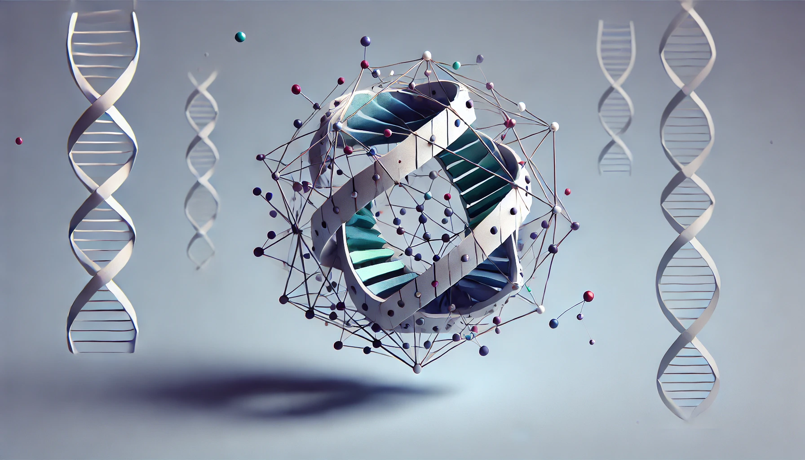

# Jointly-HiC

[](https://pypi.org/project/jointly-hic/)
[](https://github.com/abdenlab/jointly-hic/pkgs/container/jointly-hic)
[](https://github.com/abdenlab/jointly-hic/actions)



Welcome to `jointly-hic`, a Python tool for jointly embedding Hi-C 3D chromatin contact matrices into the same vector space.
Whether you're a researcher, developer, or enthusiast, this toolkit is designed to help you integrate and analyze multi-sample Hi-C datasets efficiently and effectively.

## Table of Contents
- [Introduction](#introduction)
- [Installation](#installation)
- [Usage](#usage)
  - [Input Data Preparation](#input-data-preparation)
  - [Embedding](#embedding)
  - [Post-processing](#post-processing)
  - [Trajectory Inference](#trajectory-inference)
  - [Metadata Integration](#metadata-integration)
  - [Joint HDF5 Database](#joint-hdf5-database)
- [Output](#output)
- [Contributing](#contributing)
- [CI/CD and Release Process](#cicd-and-release-process)
- [License](#license)

## Introduction

Hi-C data analysis is a powerful assay to probe chromatin organization and 3D genome structure.
`jointly-hic` facilitates the integration of multiple Hi-C datasets by jointly embedding them into the same vector space using Principal Component Analysis (PCA), Non-Negative Matrix Factorization (NMF), or Singular Value Decomposition (SVD).
The tool also includes a post-processing and visualization pipeline to help you make sense of the results.

## Installation

### Install from PyPI

```bash
pip install jointly-hic
```

### Run with Docker

```bash
docker pull ghcr.io/abdenlab/jointly-hic
```

### Install from source (for development)

```bash
git clone https://github.com/abdenlab/jointly-hic.git
cd jointly-hic
python3 -m venv venv
source venv/bin/activate
pip install -e '.[dev,notebook]'
```

## Usage

You can run `jointly` from the command line to embed, post-process, analyze trajectories, or create metadata and databases from Hi-C matrices.

To get help on available subcommands:

```bash
jointly -h
```

### Input Data Preparation

1. Prepare your Hi-C data as `.mcool` files.
2. Balance your data using `cooler balance`.
3. (Optional) Create region exclusion lists in BED format.
4. (Optional) Create metadata CSV or YAML files for experiment metadata and signal tracks.

### Embedding

```bash
jointly embed \
  --mcools sample1.mcool sample2.mcool \
  --resolution 50000 \
  --assembly hg38 \
  --method PCA \
  --components 32 \
  --output jointly_embedding
```

### Post-processing

```bash
jointly post-process \
  --parquet-file jointly_embeddings.pq \
  --umap-neighbours 30 100 500 \
  --kmeans-clusters 5 10 15
```

### Trajectory Inference

```bash
jointly trajectory \
  --parquet-file jointly_embeddings.pq
  --kmeans-clusters 5 10 15
```

### Metadata Integration

```bash
jointly embedding2yaml \
  --parquet-file jointly_embeddings_updated.pq \
  --accession-column sample_id \
  --metadata-columns condition stage \
  --yaml-file metadata/experiments.yaml

jointly tracks2yaml metadata/track_meta.csv metadata/tracks.yaml
```

### Joint HDF5 Database

```bash
jointly hdf5db \
  --experiments metadata/experiments.yaml \
  --tracks metadata/tracks.yaml \
  --embeddings jointly_embedding_embeddings.pq \
  --accession sample_id \
  --output jointly_output.h5
```

## Output

The output of the `jointly-hic` tool includes a set of files that contain the results of the analysis. The files are saved with the prefix specified by the `--output` option.

### Data Files
- `*_embeddings.pq` and `*_embeddings.csv.gz`: Raw Hi-C embeddings.
- `*_model.pkl.gz`: Serialized decomposition model (PCA or NMF).
- `*_log.txt`: Execution log.
- `*_post_processed.pq` / `*_post_processed.csv.gz`: Rescaled UMAP and clustering results.
- `*_trajectories.pq` / `*_trajectories.csv.gz`: Trajectory analysis results.
- `*_output.h5`: HDF5 database of all embeddings, metadata, and track info (if using `hdf5db`).

### Plots
- Component score plots: `*_scores.png`, `*_scores_clustered.png`, `*_scores_filenames.png`
- UMAP plots: `*_umap-n##_clustered.png`, `*_umap-n##_filenames.png`
- Trajectory UMAP: `*_trajectory_umap-n##_kmeans.png`

## Contributing

We welcome contributions to this project! If you have suggestions, bug reports, or feature requests, please open an issue or submit a pull request.

### Setup (Development)

```bash
git clone https://github.com/abdenlab/jointly-hic.git
cd jointly-hic
pip install -e '.[dev,notebook]'
pre-commit install
```

### Running Tests and Linting

```bash
ruff check jointly_hic
pytest --cov=jointly_hic --cov-report=term-missing tests
```

## CI/CD and Release Process

We use GitHub Actions for continuous integration and deployment.

### Workflow Summary

1. **CI Tests**: On every push or pull request to `main`, we run tests and linting (`python-pytest.yaml`).
2. **Versioning + Release**: If tests pass, the version is pulled from `jointly_hic/__init__.py`, and a GitHub release is created (`auto-release.yaml`).
3. **Package Publishing**:
   - The `pypi-publish.yaml` workflow builds and publishes the package to [PyPI](https://pypi.org/project/jointly-hic).
   - The `docker-publish.yaml` workflow builds a Docker image and pushes it to [GHCR](https://github.com/orgs/abdenlab/packages/container/package/jointly-hic).

## License

This project is licensed under the GNU GPL (version 3). See the [LICENSE](LICENSE) file for details.

---

Thank you for your interest in `jointly-hic`. We hope this tool aids your research and helps you uncover new insights into chromatin organization and 3D genome structure.
